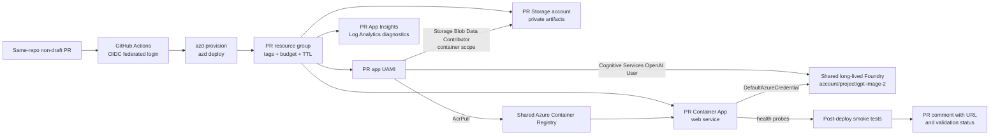

# Per-PR Ephemeral Azure Environments

Status: agreed design; implementation not started.

This document defines the per-pull-request Azure review environment design. It extends the shared deployment facts in [Azure Deployment Design](azure-deployment.md): Azure Developer CLI (`azd`) remains the deployment orchestrator, Bicep remains the only infrastructure definition path, Azure Container Apps hosts the `web` service, application probes are `/health/live` and `/health/ready`, the application uses user-assigned managed identity, and Microsoft Foundry is the approved model platform.

## Overview & goals / non-goals

Goals:

- Deploy an isolated app-tier Azure environment for every trusted same-repo, non-draft pull request so reviewers can validate the deployed web path before merge.
- Bind PR apps to one shared, long-lived Foundry account/project/model deployment for `gpt-image-2` instead of provisioning Foundry for every PR.
- Keep cost, quota, and teardown explicit through budgets, TTL tags, concurrency caps, and mandatory close-time cleanup.
- Use GitHub OIDC federation and managed identity only; do not store Azure credentials as repository or environment secrets.
- Provide deterministic environment and resource names that fit Azure limits and are stable across pushes to the same PR.
- Produce health-check evidence and a gated live-Foundry validation hook for Switch/Neo without exposing prompts, outputs, credentials, or provider internals in logs.

Non-goals:

- Do not create a Foundry account/project/model deployment per PR by default. Foundry-per-PR is a rare, gated exception only for PRs touching Foundry provisioning, model deployment, RBAC, region, safety, or provider-contract behavior.
- Do not expose Azure credentials to fork PRs. Fork PRs run build/test only.
- Do not change the production topology, domain, traffic routing, or rollback model described in [Azure Deployment Design](azure-deployment.md).
- Do not replace Bicep with imperative Azure CLI provisioning scripts or `azd up` in automation.
- Do not make PR environments permanent shared development environments.

## Architecture

Each PR environment owns the app tier: resource group, Container Apps app/environment resources required by the current deployment slice, Storage/artifacts, app identity, monitoring, budget/alerts, and any private Blob route required by the active template. All PR environments pull images from one shared Azure Container Registry and invoke one shared long-lived Foundry account/project/model deployment.



The shared Foundry deployment controls scarce `gpt-image-2` quota. Current validated capacity is too small for Foundry-per-PR as a default: quota limit 2 with usage 1 leaves only one additional deployment slot, making one Foundry deployment per open PR unscalable. Cost-bearing Foundry ephemerals therefore require a separate approval path and are capped at one.

## Naming scheme

The `azd` environment name is:

```text
pr-{number}-{slug}-{hash8}
```

- `number`: GitHub PR number.
- `slug`: sanitized meaningful slug derived from the stable branch convention `squad/{issue}-{slug}`. Use lowercase letters, digits, and hyphens; collapse separators; trim leading/trailing hyphens.
- `hash8`: first 8 lowercase hexadecimal characters of `sha256(repo|prNumber|slug)`.

Worked example for PR #14 from branch `squad/14-render-card-layout`:

| Purpose | Name | Rule |
| --- | --- | --- |
| `azd` environment | `pr-14-render-card-layout-4717e5bb` | Human-readable and stable across pushes |
| Storage account | `stfcpr144717e5bb` | `st` + compact app prefix `fc` + `pr14` + hash; lowercase alphanumeric only; ≤24 chars |
| Container App | `ca-fc-pr14-rcl-4717e5bb` | `ca-fc-` + compact PR token + acronymized slug + hash; ≤32 chars |

Per-resource compaction rules:

- Storage accounts: lowercase letters and digits only, length 3-24. Do not include hyphens. Use `stfcpr{number}{hash8}` and truncate only the numeric PR token if Azure ever rejects length, preserving `hash8`.
- Azure Container Registry names: alphanumeric only, length 5-50. PR environments do not create registries; they reference the shared ACR.
- Container Apps: length ≤32. Use `ca-fc-pr{number}-{slugCompact}-{hash8}` where `slugCompact` is built from the first character of each slug word, then extended from left to right only while the full name remains ≤32.
- Resource groups, managed environments, identities, Application Insights, action groups, and budgets should use the full `azd` environment name where service limits allow; otherwise use the same `pr{number}` + `hash8` compaction.
- The existing `ca-fantasy-cards-${env}` pattern cannot be reused as-is for PR environments. For `pr-14-render-card-layout-4717e5bb`, it would exceed the 32-character Container App limit before adding any private-app suffix.

## GitHub Actions workflow design

Use a dedicated PR environments workflow with these triggers:

- `pull_request` on `opened`, `reopened`, and `synchronize` for provision/deploy/smoke/comment.
- `pull_request` on `closed` for immediate teardown.
- `schedule` once daily for the TTL janitor.
- Optional `workflow_dispatch` for operator retry of a specific PR environment.

Deployment path:

1. Reject fork PRs from Azure steps. They run build/test only and receive no OIDC token capable of Azure access.
2. Skip draft PRs until they become ready for review.
3. Compute `azd` environment name and compact resource names deterministically from repo, PR number, and slug.
4. Check app-tier concurrency: fail closed if three app-tier PR environments are already active.
5. Authenticate to Azure through GitHub OIDC and the `azure-pr-app` GitHub Environment.
6. Configure `azd` environment variables, including shared ACR and shared Foundry references.
7. Run `azd provision`, then `azd deploy`. Do not use `azd up` in CI because provision and deploy need separate logs, gates, and failure handling.
8. Run smoke tests against `GET /health/live` and `GET /health/ready`.
9. Post or update one PR comment containing the app URL, environment name, expiry, health status, and a link to workflow logs.

Teardown path:

- On `closed`, run `azd down --purge` for the deterministic environment name and remove the PR comment or update it to show teardown status.
- The close job must run even when provision/deploy failed partway. It should tolerate absent resources and still report completion.

Janitor path:

- Daily, enumerate resource groups tagged `ephemeral=true` and `expires-at < now`.
- Tear down expired PR environments with `azd down --purge` or delete the tagged resource group if `azd` state is unavailable.
- Report orphaned or failed deletes as workflow annotations and leave enough non-secret identifiers for Tank to investigate.

Workflow concurrency:

- Use one concurrency group per PR number, for example `pr-azure-${{ github.event.pull_request.number }}`.
- Set `cancel-in-progress: true` for deploy jobs so a new push cancels obsolete provisioning/deployment for the same PR.
- Use a separate teardown concurrency group or make teardown non-cancelable so close-time cleanup cannot be interrupted by an obsolete deploy run.

## Bicep parameterization needed

The current Bicep/azd contract should be parameterized rather than forked:

- Add `deployFoundry` as a Bicep parameter. It defaults to `false` for PR environments and remains explicit for any environment that provisions Foundry.
- Add parameters for shared Foundry binding:
  - shared Foundry account resource ID or endpoint;
  - shared Foundry project identifier where needed by the app;
  - shared `gpt-image-2` deployment name;
  - shared Foundry region metadata for diagnostics.
- Grant the PR app identity only `Cognitive Services OpenAI User` (or the narrowest supported Foundry invocation role) on the shared Foundry scope. Do not grant owner/contributor or model-management roles to app-tier PR identities.
- Read generated names from `azd` environment variables instead of hardcoding `environmentName` assumptions in `infra/main.bicepparam`.
- Parameterize the shared ACR resource ID/login server and ensure PR Container Apps pull from that registry. Do not create a per-PR ACR.
- Preserve the existing AVM-first, `targetScope = 'resourceGroup'`, and native-fallback documentation rules from [Azure Deployment Design](azure-deployment.md).
- Ensure `azd provision` can create/update app-tier resources without touching shared Foundry unless `deployFoundry=true`.

### Name parameterization contract (Phase 3 work item A, #15)

`infra/web.bicep` no longer constructs its overflow-prone resource names from `environmentName`/`resourceToken`. The names are now `web.bicep`/`main.bicep` parameters, threaded from `main.bicepparam` via `readEnvironmentVariable`. Each parameter defaults to `''`; when empty the template reproduces the exact pre-existing dev-derived value, so the `dev` environment is unchanged. PR environments export the environment variables below (produced by `infra/scripts/pr_environment_names.py`) so the Azure-limit-safe names reach Bicep.

The authoritative CLI→env-var mapping is `BICEPPARAM_ENV_VARS` in `infra/scripts/pr_environment_names.py`. `pr_environment_names.py --format envvars` emits exactly these `NAME=value` lines, ready to append to `$GITHUB_ENV`:

| naming-module key | env var (read by `main.bicepparam`) | Bicep param | dev fallback when unset |
| --- | --- | --- | --- |
| `environment_name` | `AZURE_ENV_NAME` | `environmentName` | — (required) |
| `container_app` | `CONTAINER_APP_NAME` | `containerAppName` | `ca-fantasy-cards-${environmentName}` |
| `managed_environment` | `CONTAINER_APPS_ENVIRONMENT_NAME` | `containerAppsEnvironmentName` | `cae-fantasy-cards-${environmentName}` |
| `storage_account` | `STORAGE_ACCOUNT_NAME` | `storageAccountName` | `stfc${resourceToken}` |
| `virtual_network` | `VIRTUAL_NETWORK_NAME` | `virtualNetworkName` (private VNet) | `vnet-fantasy-cards-${environmentName}-private` |
| `application_insights` | `APPLICATION_INSIGHTS_NAME` | `applicationInsightsName` | `appi-fantasy-cards-dev-8f327f8c` |

Why the private VNet is included: `vnet-fantasy-cards-${environmentName}-private` reaches 65 chars for a real PR (`pr-26-relax-ci-ownership-gate-8ba70a79`), one over the 64-char VNet limit, so the naming module now emits a bounded `virtual_network` name anchored to the compacted `managed_environment` token. The other private names need no new parameter: `privateContainerAppName` derives from the 13-char `resourceToken` (always ≤32), and `privateContainerAppsEnvironmentName`/`privateEndpointName` derive from the now-parameterized (already bounded) `containerAppsEnvironmentName`/`storageAccountName`. Identity parameters (`PLATFORM_IDENTITY_NAME`/`APPLICATION_IDENTITY_NAME`) are intentionally out of this contract — a single `managed_identity` token does not map onto the two identities — and are left to the workflow (work item B).


## Cost & lifecycle

Every app-tier PR resource group carries:

| Tag | Value |
| --- | --- |
| `ephemeral` | `true` |
| `environment-type` | `pr-app` or `pr-foundry` |
| `pr-number` | PR number |
| `author` | PR author login |
| `created-at` | UTC creation timestamp |
| `expires-at` | UTC expiry timestamp |
| `repo` | owner/repo |
| `branch` | source branch |

Lifecycle rules:

- Open PR TTL is 7 days.
- Each new push resets `expires-at` to seven days from the successful deploy run.
- Closed or merged PRs are torn down immediately with `azd down --purge`.
- The daily janitor is mandatory backup cleanup for orphaned environments, failed close workflows, and deleted branches.

Cost controls:

- Each PR environment gets a resource-group monthly budget of `$50`.
- Budget alerts fire at 50%, 80%, and 100% to the approved action group.
- App-tier ephemeral concurrency is capped at three active environments.
- Cost-bearing Foundry ephemeral concurrency is capped at one active environment and requires the Foundry approval gate.
- Shared Foundry usage must be monitored separately because model invocation charges can dominate app-tier compute and storage.

## Security guardrails

- Fork PRs receive no Azure credentials, no Azure OIDC federation, and no deploy workflow permissions. They run build/test only.
- Same-repo PR deployment is automatic only for non-draft PRs.
- OIDC federation replaces stored Azure client secrets. GitHub workflow permissions should use `id-token: write` only on jobs that need Azure login and least `contents`/`pull-requests` permissions elsewhere.
- PR app identities are user-assigned managed identities with least privilege:
  - `AcrPull` on the shared ACR;
  - `Storage Blob Data Contributor` scoped to the PR artifact container;
  - `Monitoring Metrics Publisher` scoped to the PR Application Insights component;
  - `Cognitive Services OpenAI User` scoped to the shared Foundry account/project as supported.
- Do not write prompts, generated image bytes, provider response bodies, endpoints containing tenant details, credentials, or signed URLs to workflow logs or PR comments.
- Concurrency caps are security controls as well as cost controls: they limit blast radius if a same-repo PR deploy path regresses.
- Foundry-per-PR exceptions require explicit review because they can create new model capacity, RBAC, safety, and data-processing paths.

## Approval gates / GitHub Environments

Use two GitHub Environments:

| Environment | Purpose | Review policy |
| --- | --- | --- |
| `azure-pr-app` | Automatic app-tier PR provision/deploy/smoke for trusted same-repo non-draft PRs | No required reviewers; uses OIDC with least-privileged app-tier deployment permissions |
| `azure-foundry-provisioning` | Rare Foundry/model/RBAC/region/safety provisioning exceptions | Required reviewers: Benoit plus Tank or Morpheus |

This resolves issue #2 by separating routine app-tier review deployments from cost-bearing or scarce-capacity Foundry provisioning. The default path is automatic and repeatable; the exceptional path is explicitly approved.

## Post-deploy validation

Every successful deploy runs:

1. `GET /health/live` against the PR app FQDN.
2. `GET /health/ready` against the PR app FQDN.
3. PR comment update with both statuses, the app URL, expiry, and workflow run link.

The workflow also exposes a labelled live-Foundry validation hook for Switch/Neo. The hook is not automatic for every PR: it runs only when the agreed label is present and the PR is trusted. It should exercise a sanitized `gpt-image-2` card-generation path, capture pass/fail and correlation ID only, and avoid publishing prompts, image bytes, provider internals, or credentials. This ties issue #4 live Azure validation to the issue #11 card-layout follow-up without turning every PR deploy into a model-spend event.

## Pre-mortem & mitigations

| Failure mode | Mitigation |
| --- | --- |
| PR environments leak after close or failed workflow | Immediate close-time `azd down --purge`, daily TTL janitor, `ephemeral=true` and `expires-at` tags |
| Azure name exceeds service limits | Deterministic compaction rules, preflight name validation, explicit Container App ≤32 and Storage ≤24 checks |
| Same-repo PR deploys too many environments | Hard app-tier cap of three, PR-number workflow concurrency, cancel obsolete runs |
| Foundry quota exhausted | Shared Foundry default, no Foundry-per-PR unless gated, one cost-bearing Foundry exception at a time |
| Fork PR attempts credential exfiltration | No Azure OIDC or deployment job for fork PRs; build/test only |
| Shared Foundry RBAC becomes too broad | Assign only invocation role to PR app UAMI; no management roles; audit role scopes |
| Costs exceed expectations | `$50` per-env budget, 50/80/100% alerts, TTL reset on push but capped by janitor, separate shared Foundry monitoring |
| Smoke tests pass but live model path fails | Labelled live-Foundry validation hook owned by Switch/Neo for PRs that need model evidence |
| `azd` state is missing during cleanup | Fall back to deleting tagged expired resource groups after verifying `ephemeral=true` and matching PR metadata |
| PR comment leaks sensitive data | Comment only URL, environment name, expiry, health status, and workflow link; never include env vars or provider diagnostics |

## MVP scope vs deferred

MVP:

- Same-repo, non-draft PR auto-deploy on open/reopen/synchronize.
- Fork PR build/test-only enforcement.
- Deterministic `azd` environment naming and compact Azure resource names.
- Shared ACR and shared Foundry binding.
- `deployFoundry=false` default for PR app environments.
- OIDC login through `azure-pr-app`.
- `azd provision` then `azd deploy`.
- `/health/live` and `/health/ready` smoke tests.
- PR comment with URL, health status, expiry, and teardown status.
- Close-time `azd down --purge`.
- Daily TTL janitor.
- Tags, `$50` budget, and 50/80/100% alerts.
- Concurrency caps: three app-tier environments and one Foundry exception.

Deferred:

- Full Foundry-per-PR provisioning workflow beyond the gated exception skeleton.
- Automated live image generation on every PR.
- Custom domain, Front Door, API Management, or DNS integration for PR apps.
- Multi-region PR environments or recovery testing.
- Rich preview dashboards beyond the PR comment.
- Automatic visual-quality evaluation; Switch/Neo own the live-validation hook and evidence standard.

## Open questions still needing product input

Resolved:

1. **Should Foundry be provisioned per PR?** RESOLVED: no by default. App-tier PR environments bind to shared long-lived Foundry and `gpt-image-2`; Foundry-per-PR is a rare gated exception.
2. **Should a label be required to deploy a PR environment?** RESOLVED: no. Every trusted same-repo, non-draft PR deploys automatically on open/reopen/synchronize.
3. **What is the lifecycle?** RESOLVED: open PR environments live for 7 days, reset on push, and tear down immediately on close.
4. **Should each PR get its own ACR?** RESOLVED: no. One shared ACR serves all PR environments.

Still open:

- What exact label name should trigger the live-Foundry validation hook for Switch/Neo?
- Who receives budget action-group emails in addition to Benoit and Tank?
- Should failed smoke tests block PR merge through a required status check, or remain advisory during MVP?
- What is the approved wording and retention policy for PR comments after teardown?
- Should the daily janitor delete immediately on expiry or first mark expired environments and delete on the next run?

## Implementation plan

Phase 1: naming and safety preflight

- Add deterministic PR environment-name generation with unit tests for branch slug extraction, `hash8`, Storage, ACR-reference, and Container App compaction.
- Add preflight checks for fork PRs, draft PRs, same-repo trust, service name limits, app-tier concurrency cap, and Foundry exception cap.
- Map to issues: naming contract, fork security rule, concurrency guardrails.

Phase 2: Bicep and azd parameterization

- Add `deployFoundry` with PR default `false`.
- Add shared Foundry account/project/model parameters and app settings.
- Add shared ACR parameters and remove any PR ACR creation path from the PR design.
- Read generated names from `azd` environment variables instead of hardcoded `environmentName` assumptions.
- Preserve AVM-first and resource-group scope rules.
- Map to issues: Bicep PR parameterization, shared Foundry binding, shared ACR binding.

Phase 3: PR deployment workflow

- Create the GitHub Actions workflow for `pull_request` open/reopen/synchronize.
- Configure GitHub OIDC and `azure-pr-app`.
- Run `azd provision`, `azd deploy`, smoke tests, and PR comment update.
- Use per-PR concurrency with `cancel-in-progress`.
- Map to issues: auto-deploy workflow, smoke tests, PR comments, issue #2 environment gate.

Phase 4: teardown and janitor

- Add close-time `azd down --purge`.
- Add the daily TTL janitor using tags and deterministic environment names.
- Make cleanup idempotent and safe for partial deployments.
- Map to issues: mandatory teardown, TTL reaper, orphan cleanup.

Phase 5: cost and observability

- Add per-env `$50` budget and 50/80/100% alerts.
- Ensure tags are applied to resource groups and supported child resources.
- Confirm Log Analytics/Application Insights diagnostics are scoped to PR environments and do not leak sensitive provider details.
- Map to issues: budget alerts, cost tags, operational evidence.

Phase 6: Foundry exception and live validation hook

- Add `azure-foundry-provisioning` environment with required reviewers Benoit plus Tank or Morpheus.
- Add a gated path for the rare Foundry-per-PR exception with quota and cost preflight.
- Add the labelled live-Foundry validation hook for Switch/Neo using sanitized evidence only.
- Map to issues: Foundry exception gate, issue #4 live Azure validation, issue #11 card-layout follow-up.
